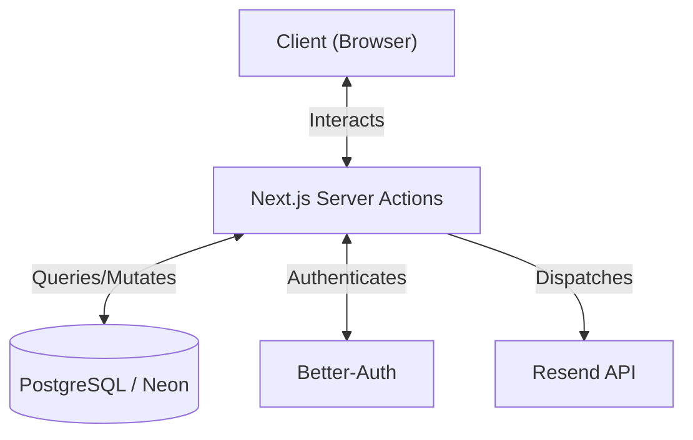

# Amazon Clone - Fullstack E-Commerce Application


A pixel-perfect replication of Amazon's core e-commerce experience, featuring real-time cart management, secure Google authentication, and transactional email notifications.

🚀 **[Live Demo](https://ecom-clone-amber-six.vercel.app/)**

## 🛠 Tech Stack

| Component | Technology | Description |
|-----------|------------|-------------|
| **Frontend** | Next.js 15 | App Router, Server Components for optimized rendering. |
| **Backend** | Server Actions | Secure server-side logic directly integrated with UI components. |
| **Auth** | Better-Auth | Robust authentication handling Google OAuth and session management. |
| **Database** | PostgreSQL | Hosted on **Neon DB** for serverless scalability. |
| **ORM** | Drizzle ORM | Type-safe database interactions and schema management. |
| **Email** | Resend | Transactional email service for order confirmations. |
| **Styling** | Tailwind CSS | Utility-first CSS with a custom Amazon-inspired color palette. |

## 🏗 Architecture & Flow

High-level overview of the application's data flow and integrations.



**Key Architectural Highlight: Server Actions**
Instead of building a traditional REST API, this application leverages **Next.js Server Actions**. This allows us to define functions that run securely on the server but can be invoked directly from Client Components (like the "Add to Cart" button). This reduces network latency, simplifies type-safety between front/back ends, and keeps the codebase fully consolidated.

## ✨ Features

✅ **Authentication**
*   Secure Login & Signup via Email/Password and Google OAuth (Better-Auth).
*   Protected routes ensuring user specific data privacy.

✅ **Shopping Experience**
*   **Dynamic Cart:** Real-time updates to cart items and totals.
*   **Wishlist:** Toggle items to saved lists. (Implemented "Good to Have" assignment bonus).
*   **Buy Box UI:** Faithful recreation of the purchase interface.

✅ **Checkout Flow**
*   Multi-step checkout process.
*   Address capture and validation.
*   Simulated payment processing for immediate order placement.

✅ **Post-Purchase**
*   **Order History:** Comprehensive list of past orders with status tracking.
*   **Email Confirmations:** Automated emails sent via Resend upon order completion.

✅ **UI/UX**
*   **Responsive Design:** Optimized for both Desktop and Mobile viewports.
*   **Amazon Aesthetic:** Implementation of specific color tokens (`#131921` Navy, `#febd69` Gold).

## 🧐 Assumptions & Design Decisions

### Auth Evolution
The project initially utilized a 'Singleton User' pattern to facilitate rapid development of core shopping logic without login barriers. As we approached production readiness, this was migrated to a full OAuth system using **Better-Auth** to ensure production-grade security and user isolation.

### Images & Performance
To optimize initial load times and minimize external dependency flakiness during the review process, **product images are sourced from public placeholders or static assets**. This ensures consistent layout performance and prevents broken images, focusing the review on functionality and layout stability.

### Payment Simulation
The checkout process intentionally **simulates a payment gateway**, placing orders immediately upon "Purchase". This decision was made to focus development hours on the Order Management logic and database consistency (as per the assignment scope) rather than integrating a live Stripe sandbox.

## 🚀 Getting Started

Follow these steps to run the project locally.

1.  **Clone the repository**
    ```bash
    git clone https://github.com/SKV-io-495/amazon_clone.git
    cd amazon_clone
    ```

2.  **Install dependencies**
    ```bash
    npm install
    ```

3.  **Environment Setup**
    ```bash
    cp .env.example .env
    # Fill in your database URL, Auth secrets, and Resend keys in .env
    ```

4.  **Database Migration**
    ```bash
    npm run db:push
    ```

5.  **Run Development Server**
    ```bash
    npm run dev
    ```

    Open [http://localhost:3000](http://localhost:3000) to view it in the browser.
